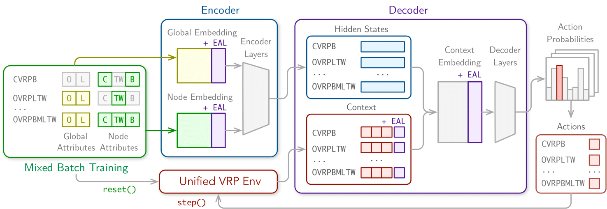
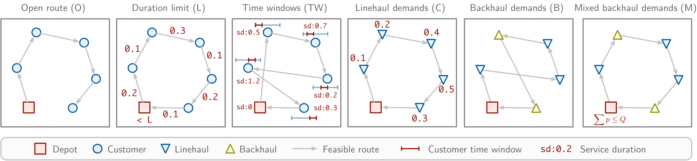
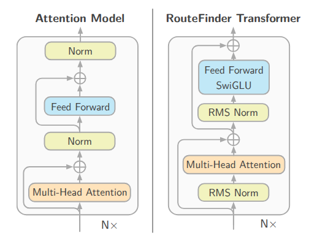

# RouteFinder

[](https://arxiv.org/abs/2406.15007) [](https://openreview.net/forum?id=hCiaiZ6e4G) [](https://join.slack.com/t/rl4co/shared_invite/zt-1ytz2c1v4-0IkQ8NQH4TRXIX8PrRmDhQ)
[](https://opensource.org/licenses/MIT)[](https://github.com/ai4co/routefinder/actions/workflows/tests.yml)<a href="https://colab.research.google.com/github/ai4co/routefinder/blob/main/examples/1.quickstart.ipynb"></a>[](https://huggingface.co/ai4co/routefinder)
[](https://huggingface.co/datasets/ai4co/routefinder)

_Towards Foundation Models for Vehicle Routing Problems_


---

<div align="center">
    
</div>


## 📰 News
- Feb 2025: A new version (`v0.3.0`) of RouteFinder has been released. We have added several improvements, among which increasing the number of VRP variants from 24 to 48! See details on the [release notes](https://github.com/ai4co/routefinder/releases/tag/v0.3.0)
- Oct 2024: A new version (`v0.2.0`) of RouteFinder has been released! We have added the latest contributions from our preprint and much improved codebase
- Jul 2024: RouteFinder has been accepted as an **Oral** presentatation at the [ICML 2024 FM-Wild Workshop](https://icml-fm-wild.github.io/)!


## 🚀 Installation

We use [uv](https://github.com/astral-sh/uv) (Python package manager) to manage the dependencies:

```bash
uv venv --python 3.12 # create a new virtual environment
source .venv/bin/activate # activate the virtual environment
uv sync --all-extras # for all dependencies
```

Note that this project is also compatible with normal `pip install -e .` in case you use a different package manager.

## 🏁 Quickstart

### Download data and checkpoints

To download the data and checkpoints from HuggingFace automatically, you can use:

```bash
python scripts/download_hf.py
```


### Running

We recommend exploring [this quickstart notebook](examples/1.quickstart.ipynb) to get started with the `RouteFinder` codebase!


The main runner (example here of main baseline) can be called via:

```bash
python run.py experiment=main/rf/rf-transformer-100
```
You may change the experiment by using the `experiment=YOUR_EXP`, with the path under [`configs/experiment`](configs/experiment) directory.


### Testing

You may use the provided test function to test the model:

```bash
python test.py --checkpoint checkpoints/100/rf-transformer.ckpt
```

or with additional parameters:

```bash
usage: test.py [-h] --checkpoint CHECKPOINT [--problem PROBLEM] [--size SIZE] [--datasets DATASETS] [--batch_size BATCH_SIZE]
               [--device DEVICE] [--remove-mixed-backhaul | --no-remove-mixed-backhaul]

options:
  -h, --help            show this help message and exit
  --checkpoint CHECKPOINT
                        Path to the model checkpoint
  --problem PROBLEM     Problem name: cvrp, vrptw, etc. or all
  --size SIZE           Problem size: 50, 100, for automatic loading
  --datasets DATASETS   Filename of the dataset(s) to evaluate. Defaults to all under data/{problem}/ dir
  --batch_size BATCH_SIZE
  --device DEVICE
  --remove-mixed-backhaul, --no-remove-mixed-backhaul
                        Remove mixed backhaul instances. Use --no-remove-mixed-backhaul to keep them. (default: True)
```


We also have a notebook to automatically download and test models on the CVRPLIB [here](examples/2.eval-cvrplib.ipynb)!

### Other scripts

- Data generation: We also include scripts to re-generate data manually (reproducible via random seeds) with `python scripts/generate_data.py`.

- Classical baselines (OR-Tools and HGS-PyVRP): We additionally include a script to solve the problems using classical baselines with e.g. `python scripts/run_or_solvers.py --num_procs 20 --solver pyvrp` to run PyVRP with 20 processes on all the dataset.


## 🔁 Reproducing Experiments

### Main Experiments
The `main` experiments on 100 nodes are (rf=RouteFinder)  RF-TE: [`rf/rf-transformer-100`](configs/experiment/main/rf/rf-transformer-100.yaml), RF-POMO: [`rf/rf-100`](configs/experiment/main/rf/rf-100.yaml), RF-MoE: [`rf/rf-moe-100`](configs/experiment/main/rf/rf-moe-100.yaml), MTPOMO [`mtpomo-100`](configs/experiment/main/mtpomo/mtpomo-100.yaml) and MVMoE [`mvmoe-100`](configs/experiment/main/mvmoe/mvmoe-100.yaml). You may substitute `50` instead for 50 nodes. Note that we separate 50 and 100 because we created an automatic validation dataset reporting for all variants at different sizes (i.e. [here](configs/experiment/rfbase-100.yaml)).


Note that additional Hydra options as described [here](https://rl4co.readthedocs.io/en/latest/_content/start/hydra.html). For instance, you can add `+trainer.devices="[0]"` to run on a specific GPU (i.e., GPU 0).

### Ablations and more

Other configs are available under [configs/experiment](configs/experiment) directory.


### EAL (Efficient Adapter Layers)

To run EAL, you may use the following command:

```bash
python run_eal.py
```

with the following parameters:

```
usage: run_eal.py [-h] [--model_type MODEL_TYPE] [--experiment EXPERIMENT]
                  [--variants_finetune VARIANTS_FINETUNE]
                  [--checkpoint CHECKPOINT] [--lr LR] [--num_runs NUM_RUNS]

options:
  -h, --help            show this help message and exit
  --model_type MODEL_TYPE
                        Model type: rf, mvmoe, mtpomo
  --experiment EXPERIMENT
                        Experiment type
  --variants_finetune VARIANTS_FINETUNE
                        Variants to finetune on
  --checkpoint CHECKPOINT
  --lr LR
  --num_runs NUM_RUNS
```

with additional parameters that can be found in the [eal.py](eal.py) file.

### Development

To test automatically if the code works, you can run:
```bash
python -m pytest tests/*
```


## 🚚 Available Environments

<div align="center">
    
</div>


We consider 48 VRP variants. All variants include the base Capacity (C). The $k=5$ features O, B, L, TW, and MD can be combined into any subset, including the empty set and itself (i.e., a power set with $2^k = 32$ possible combinations. The Mixed (M) global feature creates new Mixed Backhaul (MB) variants in generalization studies, adding 16 more variants.
We have the following environments available:

| **VRP Variant**  | **Capacity (C)** | **Open Route (O)** | **Backhaul (B)** | **Mixed (M)** | **Duration Limit (L)** | **Time Windows (TW)** | **Multi-depot (MD)** |
|------------------|:----------------:|:------------------:|:----------------:|:-------------:|:----------------------:|:---------------------:|:-------------------:|
| CVRP             | ✔                |                    |                  |               |                        |                       |                     |
| OVRP             | ✔                | ✔                  |                  |               |                        |                       |                     |
| VRPB             | ✔                |                    | ✔                |               |                        |                       |                     |
| VRPL             | ✔                |                    |                  |               | ✔                      |                       |                     |
| VRPTW            | ✔                |                    |                  |               |                        | ✔                     |                     |
| OVRPTW           | ✔                | ✔                  |                  |               |                        | ✔                     |                     |
| OVRPB            | ✔                | ✔                  | ✔                |               |                        |                       |                     |
| OVRPL            | ✔                | ✔                  |                  |               | ✔                      |                       |                     |
| VRPBL            | ✔                |                    | ✔                |               | ✔                      |                       |                     |
| VRPBTW           | ✔                |                    | ✔                |               |                        | ✔                     |                     |
| VRPLTW           | ✔                |                    |                  |               | ✔                      | ✔                     |                     |
| OVRPBL           | ✔                | ✔                  | ✔                |               | ✔                      |                       |                     |
| OVRPBTW          | ✔                | ✔                  | ✔                |               |                        | ✔                     |                     |
| OVRPLTW          | ✔                | ✔                  |                  |               | ✔                      | ✔                     |                     |
| VRPBLTW          | ✔                |                    | ✔                |               | ✔                      | ✔                     |                     |
| OVRPBLTW         | ✔                | ✔                  | ✔                |               | ✔                      | ✔                     |                     |
| VRPMB            | ✔                |                    | ✔                | ✔             |                        |                       |                     |
| OVRPMB           | ✔                | ✔                  | ✔                | ✔             |                        |                       |                     |
| VRPMBL           | ✔                |                    | ✔                | ✔             | ✔                      |                       |                     |
| VRPMBTW          | ✔                |                    | ✔                | ✔             |                        | ✔                     |                     |
| OVRPMBL          | ✔                | ✔                  | ✔                | ✔             | ✔                      |                       |                     |
| OVRPMBTW         | ✔                | ✔                  | ✔                | ✔             |                        | ✔                     |                     |
| VRPMBLTW         | ✔                |                    | ✔                | ✔             | ✔                      | ✔                     |                     |
| OVRPMBLTW        | ✔                | ✔                  | ✔                | ✔             | ✔                      | ✔                     |                     |
| MDCVRP           | ✔                |                    |                  |               |                        |                       | ✔                   |
| MDOVRP           | ✔                | ✔                  |                  |               |                        |                       | ✔                   |
| MDVRPB           | ✔                |                    | ✔                |               |                        |                       | ✔                   |
| MDVRPL           | ✔                |                    |                  |               | ✔                      |                       | ✔                   |
| MDVRPTW          | ✔                |                    |                  |               |                        | ✔                     | ✔                   |
| MDOVRPTW         | ✔                | ✔                  |                  |               |                        | ✔                     | ✔                   |
| MDOVRPB          | ✔                | ✔                  | ✔                |               |                        |                       | ✔                   |
| MDOVRPL          | ✔                | ✔                  |                  |               | ✔                      |                       | ✔                   |
| MDVRPBL          | ✔                |                    | ✔                |               | ✔                      |                       | ✔                   |
| MDVRPBTW         | ✔                |                    | ✔                |               |                        | ✔                     | ✔                   |
| MDVRPLTW         | ✔                |                    |                  |               | ✔                      | ✔                     | ✔                   |
| MDOVRPBL         | ✔                | ✔                  | ✔                |               | ✔                      |                       | ✔                   |
| MDOVRPBTW        | ✔                | ✔                  | ✔                |               |                        | ✔                     | ✔                   |
| MDOVRPLTW        | ✔                | ✔                  |                  |               | ✔                      | ✔                     | ✔                   |
| MDVRPBLTW        | ✔                |                    | ✔                |               | ✔                      | ✔                     | ✔                   |
| MDOVRPBLTW       | ✔                | ✔                  | ✔                |               | ✔                      | ✔                     | ✔                   |
| MDVRPMB          | ✔                |                    | ✔                | ✔             |                        |                       | ✔                   |
| MDOVRPMB         | ✔                | ✔                  | ✔                | ✔             |                        |                       | ✔                   |
| MDVRPMBL         | ✔                |                    | ✔                | ✔             | ✔                      |                       | ✔                   |
| MDVRPMBTW        | ✔                |                    | ✔                | ✔             |                        | ✔                     | ✔                   |
| MDOVRPMBL        | ✔                | ✔                  | ✔                | ✔             | ✔                      |                       | ✔                   |
| MDOVRPMBTW       | ✔                | ✔                  | ✔                | ✔             |                        | ✔                     | ✔                   |
| MDVRPMBLTW       | ✔                |                    | ✔                | ✔             | ✔                      | ✔                     | ✔                   |
| MDOVRPMBLTW      | ✔                | ✔                  | ✔                | ✔             | ✔                      | ✔                     | ✔                   |


We additionally provide as baseline solvers for all baselines 1) [OR-Tools](https://github.com/google/or-tools) and 2) the SotA [PyVRP](https://github.com/PyVRP/PyVRP).

### A tip for you!

Do you want to improve the performance of your model with no effort? Use our Transformer structure, based on recent models such as Llama and DeepSeek ;)

<div align="center">
    
</div>


### Known Bugs
- For some reason, there seem to be bugs when training on M series processors from Apple (but not during inference somehow?). We recommend training with a discrete GPU. We'll keep you posted with updates!


### 🤗 Acknowledgements

- https://github.com/FeiLiu36/MTNCO/tree/main
- https://github.com/RoyalSkye/Routing-MVMoE
- https://github.com/yd-kwon/POMO
- https://github.com/ai4co/rl4co


### 🤩 Citation
If you find RouteFinder valuable for your research or applied projects:

```
@inproceedings{berto2024routefinder,
    title={{RouteFinder}: Towards Foundation Models for Vehicle Routing Problems},
    author={Berto, Federico and Hua, Chuanbo and Zepeda, Nayeli Gast and Hottung, Andr{\'e} and Wouda, Niels and Lan, Leon and Tierney, Kevin and Park, Jinkyoo},
    booktitle={ICML 2024 Workshop on Foundation Models in the Wild (Oral)},
    year={2024},
    url={https://openreview.net/forum?id=hCiaiZ6e4G},
    note={\url{https://github.com/ai4co/routefinder}}
}
```

---

<div align="center">
    <a href="https://github.com/ai4co">
        
    </a>
</div>
